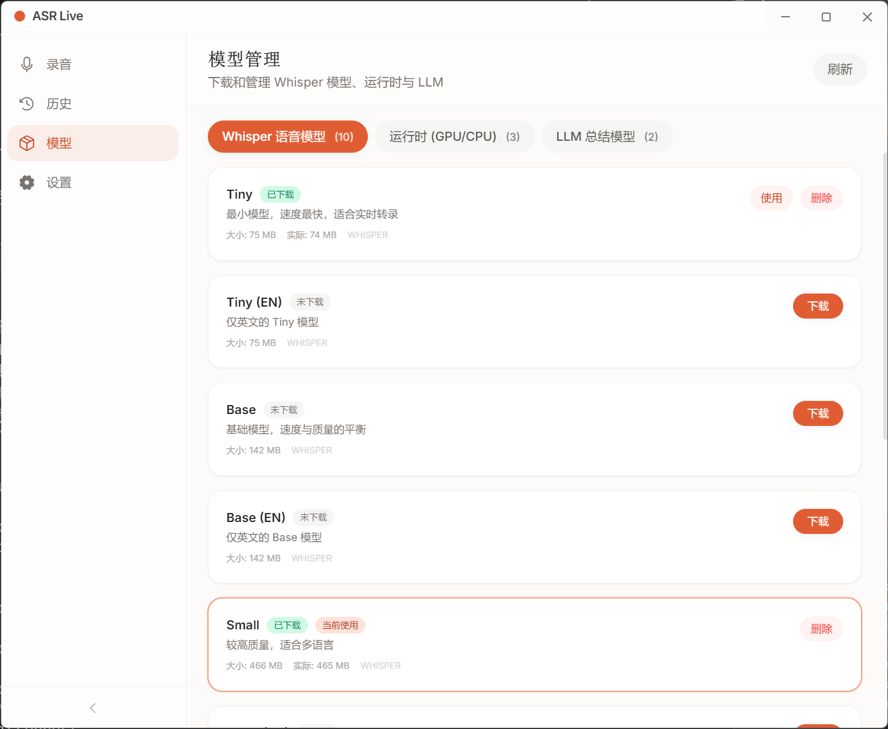

# ASR Live

实时语音转文字桌面应用 —— 基于 Whisper + 本地大模型，完全离线运行，保障隐私安全。



<!-- 请将截图放置在 docs/screenshot.png -->

## 功能特性

- **实时语音识别** — 基于 Whisper.cpp，支持 CPU / CUDA / Vulkan 多种推理方式
- **智能断句** — 基于 RMS 能量的语音活动检测（VAD），自动按静音分段
- **本地大模型摘要** — 集成 Qwen 3.5（GGUF），自动生成段落摘要和文件名
- **幻觉过滤** — 内置字幕水印、重复文本等常见幻觉检测与过滤
- **模型管理** — 一键下载 Whisper 模型（Tiny ~ Large V3）、Qwen 模型及 whisper.cpp 运行时
- **历史记录** — 按日期分组浏览、搜索、查看完整转录时间线
- **多语言支持** — 支持中文、英文、日文、韩文、法文、德文、西班牙文及自动检测
- **跨平台** — 支持 Windows、macOS、Linux

## 技术栈

| 层级 | 技术 |
|------|------|
| 桌面框架 | Electron 33 |
| 前端 | Vue 3 + Pinia + Vue Router 4 |
| 样式 | Tailwind CSS |
| 构建 | electron-vite + Vite 5 |
| 语音识别 | Whisper.cpp（外部进程） |
| 文本摘要 | node-llama-cpp + Qwen 3.5 GGUF |
| 打包分发 | electron-builder |

## 快速开始

### 环境要求

- Node.js >= 20
- npm

### 安装与运行

```bash
# 安装依赖
npm install

# 启动开发模式
npm run dev
```

### 构建安装包

```bash
# 构建并打包
npm run dist
```

生成产物：
- Windows: `dist/*.exe`（NSIS 安装包）
- macOS: `dist/*.dmg`
- Linux: `dist/*.AppImage`

## 使用说明

1. 首次启动后，前往**模型管理**页面下载所需的 Whisper 模型和运行时
2. （可选）下载 Qwen 模型以启用自动摘要功能
3. 在**设置**页面选择推理设备、语言等参数
4. 回到**录制**页面，点击录制按钮开始实时转写
5. 转写结果会自动保存，可在**历史记录**中查看

## License

MIT
